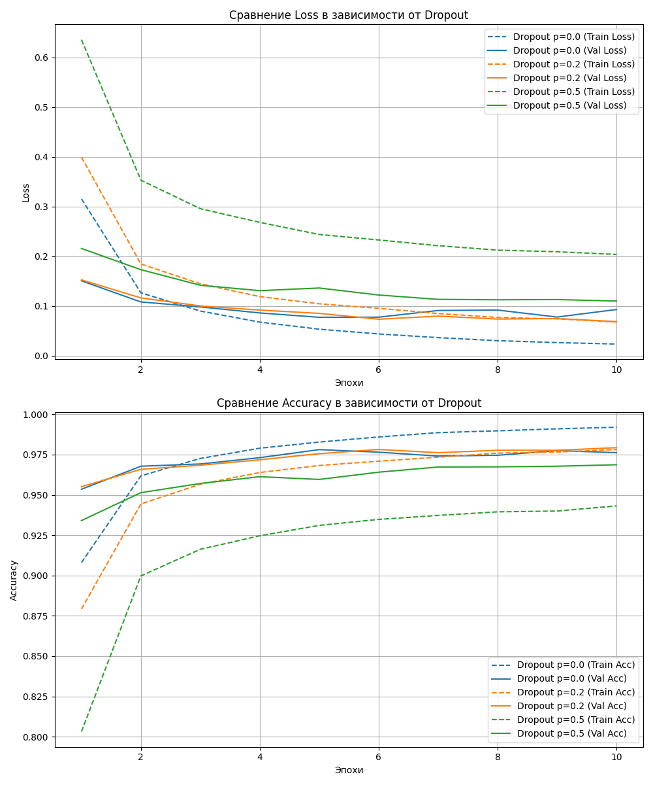

# Эксперимент: Влияние Dropout на переобучение нейронной сети

## 📝 Описание проекта

Этот проект представляет собой реализацию и проверку ключевой идеи научной статьи **"Dropout: A Simple Way to Prevent Neural Networks from Overfitting"** (Srivastava et al., 2014).

Цель эксперимента — наглядно продемонстрировать, как техника Dropout помогает бороться с переобучением (overfitting) на примере задачи классификации изображений из датасета MNIST.

Проект выполнен в рамках учебного задания (СРС-1) и включает в себя:
* Реализацию нейронной сети (MLP) на PyTorch.
* Скрипты для проведения серии экспериментов с различными уровнями Dropout.
* Код для автоматической визуализации и сравнения результатов.
* Полностью воспроизводимое окружение.

---

## 🚀 Ключевой результат

Эксперимент подтвердил гипотезу: **Dropout является эффективным методом регуляризации.**

На графиках ниже видно, что модель без Dropout (синяя линия) демонстрирует явные признаки переобучения — большой разрыв между метриками на обучающей (пунктир) и валидационной (сплошная) выборках. Модели с Dropout (оранжевая и зеленая линии) показывают значительно меньший разрыв, что говорит о лучшей обобщающей способности.



### Итоговая таблица метрик

| Dropout Rate (1-p) | Итоговая Train Accuracy | Итоговая Val Accuracy | Разрыв (Train - Val) | Вывод                      |
|:-------------------|:-----------------------:|:---------------------:|:--------------------:|:---------------------------|
| 0.0 (без Dropout)  |        99.20%           |        97.62%         |       **1.58%** | Присутствует переобучение  |
| 0.2                |        97.81%           |      **97.93%** |       -0.12%         | **Переобучение устранено** |
| 0.5                |        94.32%           |        96.87%         |       -2.55%         | Сильная регуляризация      |

---

## 🛠️ Как запустить проект

### 1. Клонирование репозитория
```bash
git clone <URL-вашего-репозитория>
cd dropout-experiment
```

### 2. Создание и активация виртуального окружения
```bash
# Создать окружение
python -m venv .venv

# Активировать (Windows PowerShell)
.\.venv\Scripts\Activate.ps1

# Активировать (macOS/Linux/Git Bash)
source .venv/bin/activate
```

### 3. Установка зависимостей
Все необходимые библиотеки перечислены в `requirements.txt`.
```bash
pip install -r requirements.txt
```

### 4. Запуск эксперимента
Эта команда последовательно обучит три модели и сохранит графики в папку `results/`.
```bash
python -m src.main
```

---

## 📂 Структура проекта
```
dropout-experiment/
├── data/
├── results/
│   ├── training_logs/
│   └── plots/
├── src/
│   ├── config.py
│   ├── model.py
│   ├── train.py
│   ├── utils.py
│   ├── visualize.py
│   └── main.py
├── .gitignore
├── README.md
└── requirements.txt
```

---

## 💻 Технологии
* Python 3.10+
* PyTorch
* Matplotlib
* NumPy
* tqdm